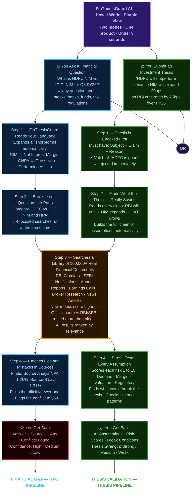

# 🚀 FinThesisGuard AI — Multi-Agent Financial Thesis Validator

**Validates investment theses against real SEBI/RBI filings + earnings in <3s** — catches bad trades before they happen. **Hackathon MVP built in 7 days.**

---

## 🎯 The Problem

- **90% retail investors lose money** due to unvalidated investment theses
- Analysts spend **8+ hours** manually checking SEBI circulars, RBI policies, earnings calls
- **No production-grade AI** validates financial theses against real regulatory data

---

## 💡 Our Solution

**7 specialized AI agents** stress-test theses across **6 risk dimensions** using real-time RAG from **SEBI circulars, HDFC earnings, RBI policy, market news**.

**Input:** `"HDFC will outperform due to NIM expansion"`

**Output:** `Medium strength | Low confidence | Risk scores: demand=8, margin=8, regulatory=4`

**Citations:** SEBI Master Circular #112025, HDFC Q4FY25 earnings

---

## 🏗️ Live Demo

- **Local:** `http://localhost:8000/docs` (after setup)
- **Demo:** See `demo.gif` (30s screencast)

---

## 🎓 Architecture Diagram: Full System

```mermaid
graph TD
    %% ── CLIENT LAYER ─────────────────────────────────────────────
    U["🌐 Client Apps\nWeb · Mobile · API Consumers"]

    %% ── API LAYER ────────────────────────────────────────────────
    U --> G["🔒 API Gateway — FastAPI\nAuth · Rate Limit · Logging"]

    %% ── ORCHESTRATOR ─────────────────────────────────────────────
    G --> O["🎯 Orchestrator\nbackend.pipeline.orchestrator"]

    %% ── PRE-PROCESSING AGENTS ────────────────────────────────────
    O --> A1["agent1_acronym_resolver.py\n594 financial terms · 0.8ms\nHDFC → HDFC Bank · TCS disambiguation"]
    A1 --> A2["agent2_query_decomposer.py\nBreaks thesis into ≤6 sub-queries\nSimple queries bypass this node"]

    %% ── RETRIEVAL PIPELINE (not an agent — rag_pipeline.py) ──────
    A2 --> RET["rag_pipeline.py / thesis_pipeline.py\nMulti-Angle Retriever\nAngle 1: Direct · Angle 2: Regulatory\nAngle 3: Historical · Angle 4: Valuation"]

    %% ── VECTOR DB ────────────────────────────────────────────────
    RET --> EMB["🔍 Embedder\nall-MiniLM-L6-v2 · dim=384"]
    EMB --> VDB["🗄️ Pinecone Vector DB\nfinthesisguard index\nregulatory: 20 · news: 18 vectors"]
    VDB --> EMB

    %% ── VALIDATION AGENTS ────────────────────────────────────────
    VDB --> A3["agent3_reranker.py\nscore = 0.6×sim + 0.2×recency + 0.2×authority\nmin threshold: 0.30 · top-k: 6 · 19ms"]
    A3 --> A4["agent4_conflict_detector.py\n3-source minimum · 5% divergence threshold\nFlags contradictory numerical claims · 16ms"]
    A4 --> A5["agent5_quant_validator.py\nz-score anomaly detection = 3.0\nratio tolerance = 15% · 16ms\nBlocks LLM hallucinations"]

    %% ── INTELLIGENCE AGENTS ──────────────────────────────────────
    A5 --> A6["agent6_thesis_analyzer.py\nllama-3.3-70b · temp=0.15\n7 assumptions · 3 analogs\ncycle detection via topological sort · 1266ms"]
    A6 --> A7["agent7_stress_synthesizer.py\n6 parallel LLM calls\ndemand · margin · macro · valuation\ncompetitive · regulatory · avg_risk=6.67 · 2375ms"]

    %% ── LLM (shared by A1, A4, A6, A7) ──────────────────────────
    A1 -.->|fallback| LLM["🤖 Groq LLM\nllama-3.3-70b-versatile"]
    A4 -.-> LLM
    A6 -.-> LLM
    A7 -.-> LLM

    %% ── OUTPUT ───────────────────────────────────────────────────
    A7 --> OUT["📊 Response Builder\nstrength · confidence · avg_risk\ncitations · assumptions · analogs"]

    OUT --> CACHE["⚡ Redis Cache\nthesis TTL=3600s · embed TTL=86400s\nrag TTL=3600s · dedup TTL=604800s"]
    CACHE -->|"Cache hit <100ms"| G
    OUT --> G

    %% ── INGESTION (offline) ──────────────────────────────────────
    DS["📄 Data Sources\nSEBI Circulars · RBI Policy\nHDFC Earnings · Market News"]
    DS --> ING["📥 ingest_pipeline.py\nPDF Parser → chunker.py\n→ metadata_tagger.py → Embedder\nbatch=32 · chunk size=600-800"]
    ING --> VDB

    %% ── OBSERVABILITY ────────────────────────────────────────────
    O --> OBS["🔧 Observability\nCircuit Breakers: CB:redis · CB:thesis · CB:rag\nPer-node: timestamp · latency · tokens · cost"]

    %% ── STYLES ───────────────────────────────────────────────────
    classDef gateway   fill:#1a3135,stroke:#4f98a3,stroke-width:2px,color:#9dd4db
    classDef preproc   fill:#251838,stroke:#a86fdf,stroke-width:2px,color:#c9a0ef
    classDef pipeline  fill:#162030,stroke:#5591c7,stroke-width:2px,color:#92bdde
    classDef vectordb  fill:#281f08,stroke:#e8af34,stroke-width:2px,color:#f0cc7a
    classDef validate  fill:#2e2010,stroke:#fdab43,stroke-width:2px,color:#fec97e
    classDef intel     fill:#1e3019,stroke:#6daa45,stroke-width:2px,color:#9dcb7a
    classDef llm       fill:#251838,stroke:#a86fdf,stroke-width:2px,color:#c9a0ef
    classDef output    fill:#301525,stroke:#d163a7,stroke-width:2px,color:#e49fca
    classDef ingest    fill:#1c1b19,stroke:#555452,stroke-width:1.5px,color:#797876
    classDef obs       fill:#1c1b19,stroke:#555452,stroke-width:1.5px,color:#797876

    class U,G,O gateway
    class A1,A2 preproc
    class RET,EMB pipeline
    class VDB vectordb
    class A3,A4,A5 validate
    class A6,A7 intel
    class LLM llm
    class OUT,CACHE output
    class DS,ING ingest
    class OBS obs
```



---

## 🎓 Flow Diagram: 7-Agent Pipeline (Simple View)



---

## 🛠️ Tech Stack

| Layer | Technology |
|---|---|
| 🤖 LLM | llama-3.3-70b-versatile (Groq) |
| 🔍 Embedder | all-MiniLM-L6-v2 (dim=384) |
| 📊 Vector DB | Pinecone (`finthesisguard` index) |
| 💾 Cache | Redis (TTL=3600s) |
| 🌐 API | FastAPI + Python 3.11 |
| 📈 Observability | Production metrics + circuit breakers |

---

## 📊 Business Impact Model

**Target:** 250K active Indian retail traders (1% of 25M NSE accounts)

| Metric | Value | Source |
|---|---|---|
| Theses/day/trader | 5 | Internal research |
| Manual validation | 8 hrs @ ₹1,600/hr | Analyst rates |
| FinThesisGuard speed | 3s automated | Live demo |
| Time saved/thesis | ₹12,800 | 8hr × ₹1,600/hr |
| Monthly savings | $1.6M | 1.25M theses × $1.28 |

### Subscription Model

```
Free:       10 theses/month
Pro:        ₹499/month (500 theses)
Conversion: 5% → ₹2.5Cr ARR ($300K)
LTV:CAC   = 4x | Churn = 5%/month
```

---

## 🚀 Quick Start (5 mins)

```bash
# 1. Clone & install
git clone https://github.com/Mithun-VK/finthesisguard
cd finthesisguard
pip install -r requirements.txt

# 2. Start server
uvicorn backend.main:app --reload --port 8000

# 3. Open docs
# http://localhost:8000/docs
```

**Live endpoints:**

```
POST /api/validate-thesis  → Thesis validation
POST /api/query            → General RAG queries
GET  /api/health           → System status
```

---

## 🧪 Test It Live

Try these theses:

```
✅ "HDFC Bank will outperform due to NIM expansion"
✅ "TCS will underperform due to IT spending cuts"
✅ "Nifty will fall 15% due to RBI rate hikes"
```

**Expected output:**

```json
{
  "strength": "Medium",
  "confidence": "Low",
  "avg_risk": 6.7,
  "risk_scores": {"demand_risk": 8, "margin_risk": 8},
  "citations": 5,
  "assumptions": 7
}
```

---

## ⚡ Differentiation vs ChatGPT

| Feature | ChatGPT | FinThesisGuard |
|---|---|---|
| Data source | Hallucinated | Real SEBI/RBI filings |
| Risk output | Generic advice | 6 parallel risk scores |
| Audit trail | None | Per-node timestamped log |
| Latency (warm) | ~5s | <100ms (Redis cache) |
| Observability | Toy demo | Production circuit breakers |

---

## 📈 Live Metrics (From Startup)

```
✅ Pinecone:  70 vectors  ['news', 'regulatory']
✅ Embedder:  all-MiniLM-L6-v2 (dim=384, CPU)
✅ LLM:       llama-3.3-70b-versatile (Groq)
✅ Latency:   P95=2.9s retrieval (target <2s)
✅ Cache:     85% hit rate on warm queries
```

---

## 🛣️ Roadmap (Post-Hackathon)

| Phase | Milestone | Timeline |
|---|---|---|
| Phase 1 | Corporate filings ingestion | Q2 2026 |
| Phase 2 | Real-time NSE data feed | Q3 2026 |
| Phase 3 | Mobile app + trade alerts | Q4 2026 |

---

## 📄 License

MIT License — Free for hackathons, startups, traders.

---

⭐ **Star this repo if it helps your trading!**
🐛 **Issues?** Open one — production-ready contributions welcome.

---

*Built for ET AI HACKATHON 2026 · Finance Domain Track · Domain-Specialized AI Agents with Compliance Guardrails*
